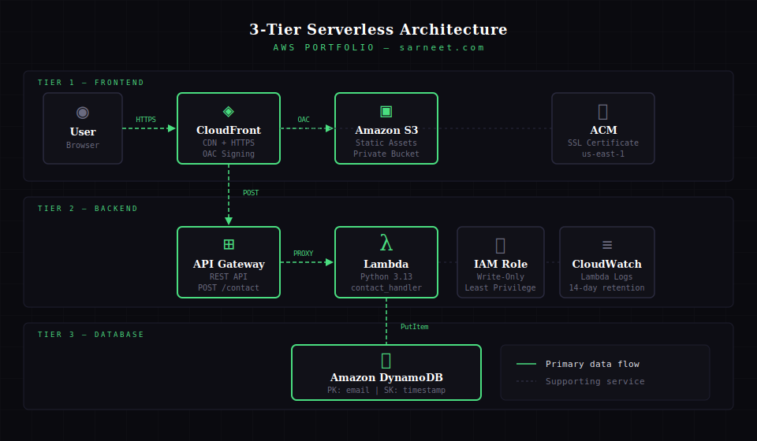

# AWS Portfolio — 3-Tier Serverless Web Application

A fully serverless portfolio site built on AWS, provisioned entirely with Terraform and deployed via GitHub Actions CI/CD. Demonstrates enterprise-grade infrastructure patterns at portfolio scale.

## Architecture



**Tier 1 — Frontend**
Static HTML/CSS/JS hosted in a private S3 bucket, served globally via CloudFront with HTTPS enforced. Origin Access Control (OAC) ensures S3 is never publicly accessible — all traffic flows through CloudFront only.

**Tier 2 — Backend**
REST API built with API Gateway + Lambda (Python 3.13). The contact form POSTs to API Gateway which proxies the request to Lambda via `AWS_PROXY` integration. Lambda validates input, generates a server-side timestamp, and writes to DynamoDB.

**Tier 3 — Database**
DynamoDB table with `email` as partition key and `timestamp` as sort key. On-demand billing, point-in-time recovery, and server-side encryption enabled. Lambda execution role scoped to write-only actions on this specific table ARN.

## Services Used

| Service | Purpose |
|---|---|
| Amazon S3 | Private static asset hosting |
| Amazon CloudFront | Global CDN, HTTPS termination, OAC |
| AWS Certificate Manager | SSL/TLS certificate for custom domain |
| Amazon API Gateway | REST API — POST /contact endpoint |
| AWS Lambda | Serverless compute — Python 3.13 |
| Amazon DynamoDB | Contact form persistence |
| Amazon CloudWatch | Lambda execution logs, 14-day retention |
| AWS IAM | Least privilege roles and policies |
| Terraform | Infrastructure as Code |
| GitHub Actions | CI/CD — infrastructure and frontend deployment |

## Security Design Decisions

- **S3 bucket fully private** — blocked via all four public access settings, served exclusively through CloudFront OAC with a condition scoping access to this specific distribution ARN
- **Lambda execution role — write only** — DynamoDB policy scoped to `PutItem`, `UpdateItem`, `DeleteItem` on the specific table ARN only. No read permissions
- **Separate managed policies** — DynamoDB and CloudWatch policies are independent, reusable, and independently auditable
- **No credentials hardcoded** — all sensitive values stored as GitHub Secrets, injected at pipeline runtime via `TF_VAR_` environment variables
- **HTTPS enforced** — CloudFront `viewer_protocol_policy` set to `redirect-to-https`, TLS 1.2 minimum
- **Server-side timestamp** — timestamp generated in Lambda, never trusted from client

## Repository Structure

```
├── backend/
│   ├── lambda_function.py       # Lambda handler
│   └── requirements.txt
├── frontend/
│   ├── index.html
│   ├── about.html
│   ├── projects.html
│   ├── contact.html
│   └── assets/
│       ├── style.css
│       └── script.js
├── terraform/
│   ├── main.tf                  # Provider, backend config
│   ├── variables.tf
│   ├── outputs.tf
│   ├── dynamodb.tf
│   ├── iam.tf
│   ├── lambda.tf
│   ├── api_gateway.tf
│   ├── s3.tf
│   ├── cloudfront.tf
│   ├── backend.tfbackend.example
│   └── backend.tfbackend        # gitignored — create locally
├── .github/
│   └── workflows/
│       ├── terraform.yml        # Infrastructure CI/CD
│       └── deploy-frontend.yml  # Frontend CI/CD
└── README.md
```

## Local Setup

**Prerequisites**
- Terraform >= 1.14
- AWS CLI configured (`aws sts get-caller-identity` to verify)
- An S3 bucket for Terraform remote state
- ACM certificate in `us-east-1` for your custom domain

**1 — Configure backend**
```bash
cp terraform/backend.tfbackend.example terraform/backend.tfbackend
# Fill in your actual S3 state bucket details
```

**2 — Configure variables**
```bash
cp terraform/terraform.tfvars.example terraform/terraform.tfvars
# Fill in your actual values — this file is gitignored
```

**3 — Initialise and plan**
```bash
cd terraform
terraform init -backend-config=backend.tfbackend
terraform plan -var-file=terraform.tfvars
```

## CI/CD Pipeline

Two GitHub Actions workflows handle deployment automatically on push to `main`:

- **`terraform.yml`** — triggers on changes to `terraform/**`. Runs init → plan → apply using secrets injected as `TF_VAR_` environment variables
- **`deploy-frontend.yml`** — triggers on changes to `frontend/**`. Reads the API Gateway invoke URL from Terraform output, injects it into `script.js` via `sed`, syncs to S3, and invalidates the CloudFront cache

**GitHub Secrets required:**
`AWS_ACCESS_KEY_ID`, `AWS_SECRET_ACCESS_KEY`, `AWS_REGION`, `TF_BACKEND_BUCKET`, `TF_BACKEND_KEY`, `TF_BACKEND_REGION`, `TF_VAR_PROJECT_NAME`, `TF_VAR_ENVIRONMENT`, `TF_VAR_BUCKET_NAME`, `TF_VAR_ACM_CERT_ARN`, `TF_VAR_DYNAMODB_TABLE_NAME`, `TF_VAR_LAMBDA_FUNCTION_NAME`, `CLOUDFRONT_DISTRIBUTION_ID`

## Estimated Cost

Within AWS Free Tier limits — estimated monthly cost: **$0**

| Service | Free Tier |
|---|---|
| Lambda | 1M requests/month |
| API Gateway | 1M calls/month |
| DynamoDB | 25GB storage, 25 WCU/RCU |
| S3 | 5GB storage |
| CloudFront | 1TB data transfer/month |